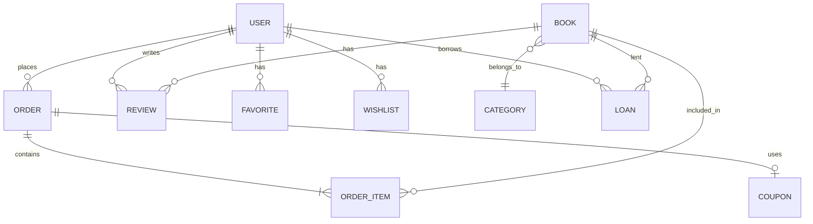

# 📚 Kitabika - Online Kitap Satış ve Yönetim Sistemi

<p align="center">
  
  
  
  
</p>

**Kitabika**, katmanlı mimari ile geliştirilmiş, hem admin paneli hem de kullanıcı arayüzüne sahip tam teşekküllü bir kitap satış ve yönetim sistemidir.  Online kitap satışı ve yönetimi için tüm temel işlevselliği sağlar.

## 📋 İçindekiler

- [Özellikler](#-özellikler)
- [Ekran Görüntüleri](#-ekran-görüntüleri)
- [Mimari](#-mimari)
- [Teknolojiler](#-teknolojiler)
- [Kurulum](#-kurulum)
- [Veritabanı Şeması](#-veritabanı-şeması)
- [Katkıda Bulunma](#-katkıda-bulunma)

## ✨ Özellikler

### 👤 Kullanıcı Özellikleri
- 🔐 Kullanıcı kayıt ve giriş sistemi
- 📖 Kitap arama ve filtreleme
- 🛒 Sepet yönetimi
- ❤️ Favori listesi
- 📋 İstek listesi (Wishlist)
- 📦 Sipariş takibi
- ⭐ Kitap değerlendirme ve yorum yapma
- 🎟️ Kupon kodu kullanımı

### 👨‍💼 Admin Özellikleri
- 📚 Kitap ekleme, düzenleme ve silme
- 📁 Kategori yönetimi
- 👥 Kullanıcı yönetimi
- 📊 Sipariş yönetimi
- 🎫 Kupon oluşturma ve yönetimi
- 📈 Satış raporları

### 📖 Kitap Ödünç Alma
- Kitap ödünç alma sistemi
- İade takibi
- Gecikme bildirimleri

## 🏗 Mimari

Proje **N-Tier Architecture** (Katmanlı Mimari) kullanılarak geliştirilmiştir: 

```
┌─────────────────────────────────────────┐
│           Presentation Layer            │
│            (BookStore.Web)              │
│    MVC Controllers, Views, ViewModels   │
├─────────────────────────────────────────┤
│            Service Layer                │
│          (BookStore.Service)            │
│     Business Logic, Validations         │
├─────────────────────────────────────────┤
│             Data Layer                  │
│           (BookStore. Data)              │
│   DbContext, Repositories, Migrations   │
├─────────────────────────────────────────┤
│             Core Layer                  │
│           (BookStore.Core)              │
│     Entities, Interfaces, Enums         │
└─────────────────────────────────────────┘
```

## 🛠 Teknolojiler

- **ASP.NET Core MVC 8.0** - Web framework
- **Entity Framework Core** - ORM
- **SQL Server** - Veritabanı
- **Bootstrap 5** - UI framework
- **jQuery** - JavaScript kütüphanesi
- **AutoMapper** - Object mapping
- **Identity** - Kimlik doğrulama ve yetkilendirme

## 🚀 Kurulum

### Gereksinimler
- .NET 8.0 SDK
- SQL Server 2019+
- Visual Studio 2022 veya VS Code

### Adımlar

```bash
# Repository'yi klonlayın
git clone https://github.com/kadirbeskardes/Kitabika.git
cd Kitabika

# Bağımlılıkları yükleyin
dotnet restore

# Veritabanı bağlantı string'ini appsettings.json'da güncelleyin
# "ConnectionStrings":  { "DefaultConnection": "Your-Connection-String" }

# Migration'ları uygulayın
dotnet ef database update --project BookStore.Data

# Uygulamayı çalıştırın
dotnet run --project BookStore.Web
```

## 📁 Proje Yapısı

```
Kitabika/
├── BookStore.Core/                 # Domain katmanı
│   ├── Entities/
│   │   ├── BaseEntity.cs          # Temel entity sınıfı
│   │   ├── Book.cs                # Kitap entity
│   │   ├── Category.cs            # Kategori entity
│   │   ├── User.cs                # Kullanıcı entity
│   │   ├── Order. cs               # Sipariş entity
│   │   ├── OrderItem.cs           # Sipariş kalemi entity
│   │   ├── Review.cs              # Değerlendirme entity
│   │   ├── Favorite.cs            # Favori entity
│   │   ├── Wishlist.cs            # İstek listesi entity
│   │   ├── Coupon.cs              # Kupon entity
│   │   └── Loan.cs                # Ödünç entity
│   ├── Interfaces/                # Repository arayüzleri
│   └── Enums/                     # Enum tanımları
├── BookStore. Data/                # Veri erişim katmanı
├── BookStore.Service/             # İş mantığı katmanı
└── BookStore.Web/                 # Web uygulaması
```

## 🗄 Veritabanı Şeması



## 🎯 Kullanım Senaryoları

### Kitap Satın Alma
1. Kullanıcı kayıt olur veya giriş yapar
2. Kitapları arar ve inceler
3. Sepete ekler
4. Kupon kodu uygular (opsiyonel)
5. Sipariş oluşturur
6. Ödeme yapar

### Kitap Ödünç Alma
1. Kullanıcı ödünç almak istediği kitabı seçer
2. Ödünç alma talebinde bulunur
3. Admin onaylar
4. Belirlenen sürede iade eder

## 🤝 Katkıda Bulunma

Katkılarınızı bekliyoruz!  Lütfen önce bir issue açarak değişikliğinizi tartışın.

1. Fork edin
2. Feature branch oluşturun (`git checkout -b feature/AmazingFeature`)
3. Commit edin (`git commit -m 'Add some AmazingFeature'`)
4. Push edin (`git push origin feature/AmazingFeature`)
5. Pull Request açın

## 📄 Lisans

Bu proje MIT lisansı altında lisanslanmıştır. 

---

<p align="center">
  Made with ❤️ by <a href="https://github.com/kadirbeskardes">Kadir Beskardes</a>
</p>
